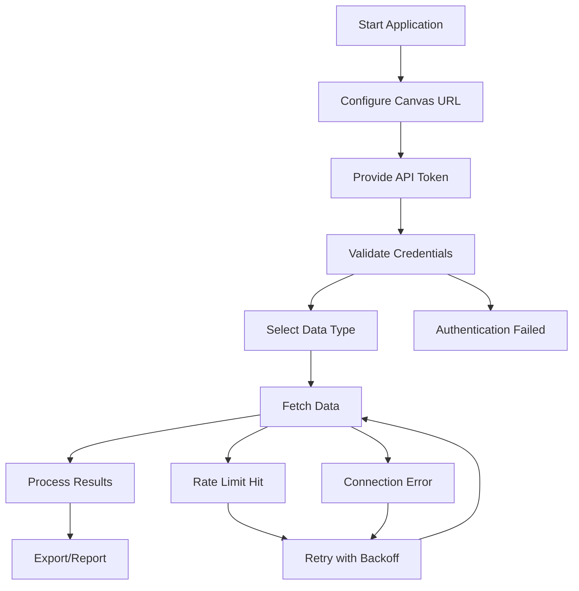

# Canvas API Data Retrieval Application - Product Requirements Document

## 1. Product Overview
A Python application that provides secure access to Canvas LMS data through API integration, enabling users to retrieve courses, assignments, grades, and user information programmatically.

The application solves the challenge of manual data extraction from Canvas by providing automated, authenticated access to educational data for analysis, reporting, and integration purposes.

## 2. Core Features

### 2.1 User Roles
| Role | Registration Method | Core Permissions |
|------|---------------------|------------------|
| Canvas User | Canvas API token authentication | Can access their own course data, assignments, and grades |
| Administrator | Canvas admin API token | Can access institutional data, user management, and course analytics |

### 2.2 Feature Module
Our Canvas API application consists of the following main components:
1. **Authentication Module**: API token management, secure credential storage
2. **Data Retrieval Module**: Course data, assignment data, grade data, user information
3. **Error Handling Module**: API rate limiting, connection errors, data validation
4. **Export Module**: Data formatting, file export capabilities

### 2.3 Page Details
| Module Name | Feature Name | Feature Description |
|-------------|--------------|--------------------|
| Authentication Module | Token Management | Store and validate Canvas API tokens securely, handle token refresh and expiration |
| Authentication Module | Institution Setup | Configure Canvas instance URL and validate connection |
| Data Retrieval Module | Course Data Access | Fetch course information, enrollment data, course settings and metadata |
| Data Retrieval Module | Assignment Management | Retrieve assignment details, due dates, submission requirements and grading criteria |
| Data Retrieval Module | Grade Analytics | Access student grades, assignment scores, course averages and grade distributions |
| Data Retrieval Module | User Information | Get user profiles, enrollment status, role assignments and activity data |
| Error Handling Module | Rate Limit Management | Handle API rate limits, implement retry logic with exponential backoff |
| Error Handling Module | Connection Handling | Manage network timeouts, connection errors and API availability issues |
| Export Module | Data Export | Export retrieved data to CSV, JSON, Excel formats with customizable fields |
| Export Module | Report Generation | Generate formatted reports with data visualization and summary statistics |

## 3. Core Process
**Main User Flow:**
1. User configures Canvas instance URL and provides API token
2. Application validates credentials and establishes connection
3. User selects data type to retrieve (courses, assignments, grades, users)
4. Application fetches data with proper error handling and rate limiting
5. User can export data in preferred format or generate reports

**Administrator Flow:**
1. Admin provides institutional API token with elevated permissions
2. Application accesses broader institutional data sets
3. Admin can retrieve cross-course analytics and user management data
4. Bulk data operations with progress tracking and error reporting

## 4. User Interface Design
### 4.1 Design Style
- **Primary Colors**: Canvas blue (#0374B5), white (#FFFFFF)
- **Secondary Colors**: Gray (#6B7280), green for success (#10B981), red for errors (#EF4444)
- **Button Style**: Rounded corners with subtle shadows, hover effects
- **Font**: System fonts (SF Pro on macOS, Segoe UI on Windows), 14px base size
- **Layout Style**: Clean command-line interface with clear status indicators and progress bars
- **Icons**: Simple monochrome icons for data types and status indicators

### 4.2 Page Design Overview
| Module Name | Component Name | UI Elements |
|-------------|----------------|-------------|
| Authentication Module | Configuration Panel | Input fields for Canvas URL and API token, validation status indicators, secure storage options |
| Data Retrieval Module | Data Selection Interface | Dropdown menus for data types, date range selectors, filtering options with checkboxes |
| Error Handling Module | Status Display | Progress bars, error messages with retry buttons, rate limit countdown timers |
| Export Module | Output Options | Format selection radio buttons, file path chooser, export progress indicators |

### 4.3 Responsiveness
Command-line application optimized for terminal environments with clear text formatting, progress indicators, and responsive output that adapts to terminal width.