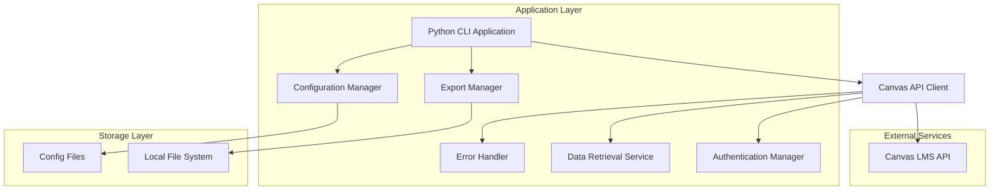
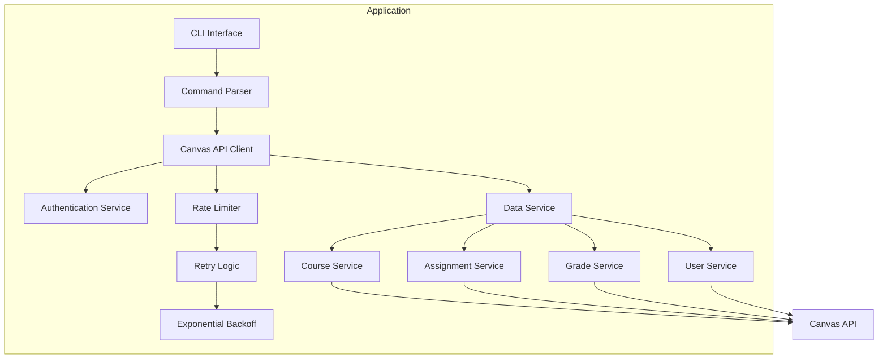
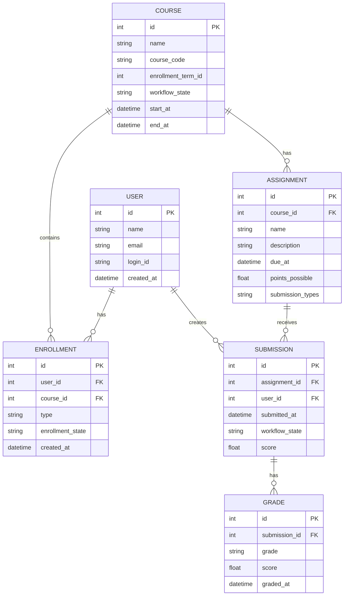

# Canvas API Data Retrieval Application - Technical Architecture Document

## 1. Architecture Design



## 2. Technology Description
- Frontend: Python CLI application with argparse and rich for enhanced terminal UI
- Backend: None (direct API integration)
- HTTP Client: requests library for Canvas API communication
- Authentication: Canvas API token-based authentication
- Data Processing: pandas for data manipulation and analysis
- Export: openpyxl for Excel export, built-in csv and json modules
- Configuration: python-dotenv for environment variable management
- Error Handling: Custom retry logic with exponential backoff

## 3. Route Definitions
| Command | Purpose |
|---------|----------|
| `python canvas_client.py auth --setup` | Configure Canvas instance URL and API token |
| `python canvas_client.py courses --list` | List all accessible courses |
| `python canvas_client.py assignments --course-id <id>` | Get assignments for specific course |
| `python canvas_client.py grades --course-id <id>` | Retrieve grades for specific course |
| `python canvas_client.py users --course-id <id>` | Get user information for course |
| `python canvas_client.py export --format <csv/json/xlsx>` | Export last retrieved data |

## 4. API Definitions

### 4.1 Core API

Canvas API Authentication
```
GET /api/v1/users/self
Headers: Authorization: Bearer <api_token>
```

Request:
| Param Name | Param Type | isRequired | Description |
|------------|------------|------------|-------------|
| api_token | string | true | Canvas API access token |

Response:
| Param Name | Param Type | Description |
|------------|------------|-------------|
| id | integer | User ID in Canvas |
| name | string | User's full name |
| email | string | User's email address |

Course Data Retrieval
```
GET /api/v1/courses
```

Request:
| Param Name | Param Type | isRequired | Description |
|------------|------------|------------|-------------|
| enrollment_state | string | false | Filter by enrollment state (active, completed) |
| per_page | integer | false | Number of results per page (default: 10, max: 100) |

Response:
| Param Name | Param Type | Description |
|------------|------------|-------------|
| id | integer | Course ID |
| name | string | Course name |
| course_code | string | Course code |
| enrollment_term_id | integer | Term ID |

Assignment Data Retrieval
```
GET /api/v1/courses/{course_id}/assignments
```

Request:
| Param Name | Param Type | isRequired | Description |
|------------|------------|------------|-------------|
| course_id | integer | true | Canvas course ID |
| include[] | array | false | Additional data to include (submissions, rubric) |

Response:
| Param Name | Param Type | Description |
|------------|------------|-------------|
| id | integer | Assignment ID |
| name | string | Assignment name |
| due_at | datetime | Due date |
| points_possible | float | Maximum points |

## 5. Server Architecture Diagram



## 6. Data Model

### 6.1 Data Model Definition



### 6.2 Data Definition Language

Configuration Storage (Local JSON)
```json
{
  "canvas_config": {
    "base_url": "https://your-institution.instructure.com",
    "api_token": "encrypted_token_here",
    "rate_limit": {
      "requests_per_hour": 3000,
      "burst_limit": 100
    },
    "export_settings": {
      "default_format": "csv",
      "output_directory": "./exports"
    }
  }
}
```

Data Cache Structure (Local JSON)
```json
{
  "courses": [
    {
      "id": 12345,
      "name": "Introduction to Computer Science",
      "course_code": "CS101",
      "enrollment_term_id": 1,
      "workflow_state": "available",
      "start_at": "2024-01-15T00:00:00Z",
      "end_at": "2024-05-15T23:59:59Z"
    }
  ],
  "assignments": [
    {
      "id": 67890,
      "course_id": 12345,
      "name": "Programming Assignment 1",
      "due_at": "2024-02-01T23:59:59Z",
      "points_possible": 100.0,
      "submission_types": ["online_upload"]
    }
  ],
  "last_updated": "2024-01-20T10:30:00Z"
}
```